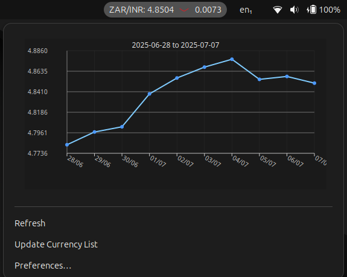

# Currency Conversion Rate for GNOME Shell


A simple and elegant GNOME Shell extension that displays real-time currency conversion rates directly on your top panel.




## Features

*   **Real-time Rate Display**: See the latest conversion rate for your chosen currency pair in the GNOME top panel.
*   **Daily Change Indicator**: A visual icon (▲, ▼, or ―) shows you if the rate has gone up, down, or stayed the same since yesterday.
*   **Historical Data Chart**: A simple text-based line chart in the dropdown menu visualizes the rate trend over the last M/Y/Max.
*   **Customizable Currencies**: Use the preferences window to select any base and target currency from a comprehensive list.
*   **Manual Refresh**: Instantly fetch the latest rates with a "Refresh" button in the menu and update the currency list.
*   **Resilient Design**: Works reliably using standard, legacy-compatible GNOME Shell features for maximum stability.

## Installation

1. Clone this repository:
```bash
git clone https://github.com/pipedream/currency-conversion-rate.git
cd currency-conversion-rate
```
2. Install and compile schemas:
```bash
zip -r currency.zip metadata.json extension.js prefs.js convenience.js stylesheet.css currencies.min.json schemas/
gnome-extensions install --force currency.zip
glib-compile-schemas ~/.local/share/gnome-shell/extensions/currency-conversion-rate@pipedream.github.com/schemas/
```
3. Log out and in again (Wayland) and enable the extension using GNOME Extensions app or GNOME Tweaks

## Supported list of currencies, which can be paired

- Refer - https://cdn.jsdelivr.net/npm/@fawazahmed0/currency-api@latest/v1/currencies.min.json

## License

- This project is licensed under the GPL-3.0 License - see the [LICENSE](LICENSE) file for details.

## Acknowledgments

- This extension forked from https://github.com/binary-smith/currency-conversion-rate, claude-coded for Gnome shell 48
- This extension uses the free currency-api by fawazahmed0 for exchange rate data - https://github.com/fawazahmed0/exchange-api
- Also inspired by an existing GNOME extension - https://github.com/faymaz/currency-tracker
